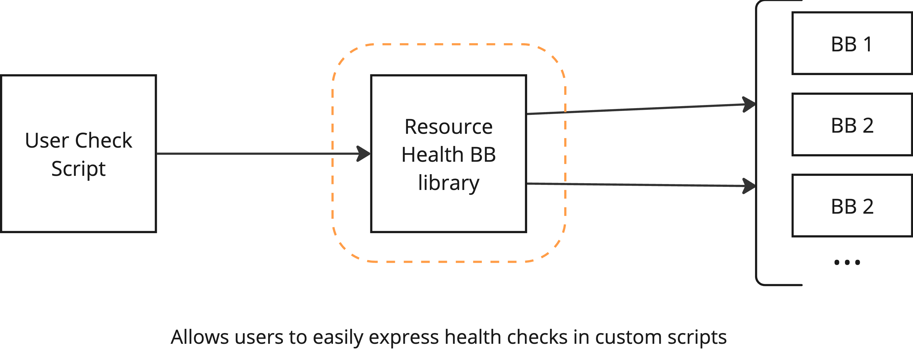

# Core ("Level 0")

At its core, the Resource Health BB provides a health-check support library for expressing health-checks, using a standard scripting language, and an executor for ensuring the correct setup for running and collecting the results of a single such script. The choice made here is to simply augment and adapt the Pytest framefork, as Pytest already provides much of the necessary functionality: expressing expectations about pieces of data and collating whether or not such expectations are satisfied for a particular run. These scripts also indicate their preferred execution schedule and triggers which, at level 0, are purely indicative.

Given minimal setup and authentication, a single such script could even be executed locally on the computer of the end-user. We will refer to this as level 0 functionality, which can be achieved with no or only minimal centralised services on the platform (beyond the functionality being checked).

For example, an end-user can run a health-check script that checks that a published application endpoint is responding much the same way they would issue a ping command to check the uptime of another host machine.
"code free" health-checks are achieved by simply writing reusable scripts that take necessary parameters as input arguments.

The rest of the resource health BB is concerned with supporting the management of health-checks, their timely execution, as well as the persisting and consumption of their outcomes.

