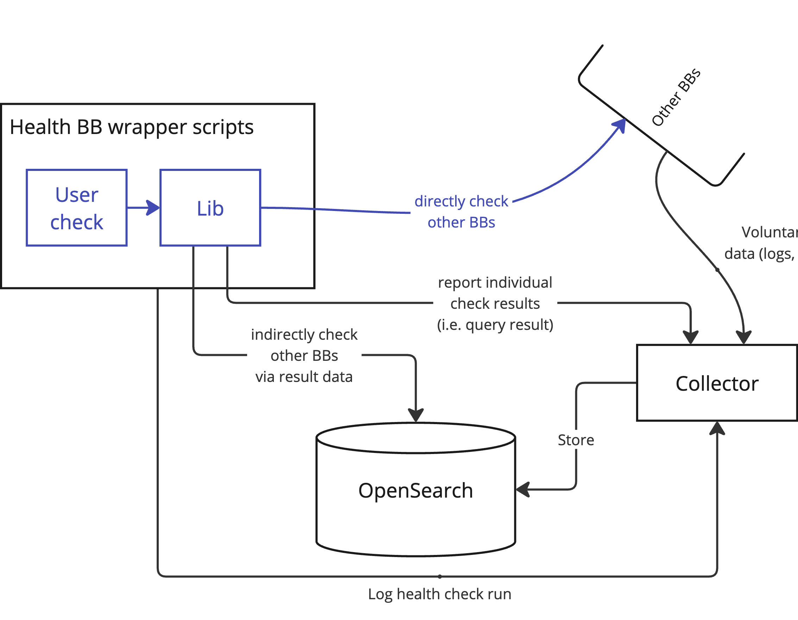

# Level 1

The first level of additional functionality is for persisting and making available (past) health-check results. This is achieved by the resource health BB providing a telemetry (or application performance monitoring) database, preferably OpenSearch with an OpenTelemetry collector as ingestion endpoint. This database serves to store metrics (time series), logs, and traces.

In particular, the health-check support library and executor are written in such a way that, when the database is available, the following parts of the health-check script execution are logged to the database:

- The start and end of the health-check script execution,
- The final verdict of the health-check script execution,
- The outcomes of any intermediate evidence collected using the health-check support library during the check (e.g. response of a polled endpoint or query result),
- The outcomes of any intermediate assertion expressed using the health-check support library.

This is achieved by instrumenting health check scripts in such a way that any health-check related or widely used library operation generates a "log" to the database, in addition to executing the operation itself. In case the end-user wants to log some additional information, they can do so by calling the "logging" functions themselves.

Having the above information logged means that the end-user (or an application acting on behalf of the end-user) has access to full execution statistics of the health-check and access to the precise evidence that was inspected for the health-check to make its verdict. Viewing such outcomes is simply a question of querying and visualizing these events. We provide a web UI for that, but the user can also inspect them in OpenSearch Dashboards, or write a script for which queries the data and generates more custom visualizations. We might use OpenSearch alerts and notifications to generate notifications to the end user (email, chat, webhooks, ...) on specific health-check related events.

A second use for the telemetry database is for other building blocks to share telemetry (metrics, logs, or traces) on a "voluntary basis". Such telemetry can then be used to write more robust and faster health-checks by expressing assertions concerning information in the database instead of directly interacting with the building block being checked. The OpenTelemetry collector simplifies by providing a standardised means (format and protocol) for communicating telemetry, given by the OpenTelemetry standards.

Beyond the requirements of "level 0" functionality, the above "level 1" functionality outlined above requires only the telemetry database (and supporting services) to have been provisioned. Health-check scripts must still be executed by the end-user in an appropriate environment.

