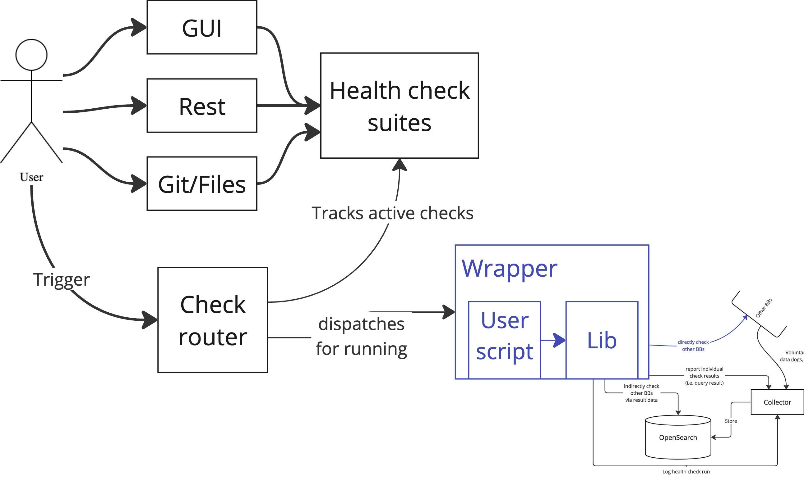

# Level 2

The next level of additional functionality is to centrally organize (suites of) health-check scripts and automatically provision means for their execution.

A suite of health-checks is simply a collection of health-check scripts, stored in one place, that will be executed with the privileges of a specified identity (or group). The simplest use case is a user-specific suite of health-checks, accessible only to the specific user and executed with the privileges of the same. Currently the primary way that such suites are stored is as Kubernetes CronJob attributes.

All interfaces (Web UI, REST API, and Git with CI/CD) are then simply concerned with exposing the ability to create and delete suites and with modifying the set of health-check script files in each suite. In particular, synchronising from a git repository is a matter of syncronising (some subset) of health-check script files from a git repository.

A custom service (execution and scheduling) in the resource health BB monitors the set of existing suites (by way of regular polling, by notifications from the workspace building block, or by internal notifications generated from the internal interfaces of the resource health building block). It does so in order to track which checks are available, and what are their preferred execution schedule/triggers.

The only external end-point provided by this service is a means to explicitly and asynchronously trigger the execution of a specific health-check script or suite of health check scripts.

Triggering such an execution is essentially equivalent to what the end-user would have done at level 0 or level 1 functionality. The service only ensures the necessary authentication steps are performed and that an execution environment is provisioned. The current implementation for provisioning the execution environment is to create a Kubernetes CronJob for each health check and Kubernetes will execute that check upon receiving a suitable trigger. Among the alternatives is to rely on the Processing and/or Federated orchestration building blocks to execute the health checks.

Since the health-check scripts and their execution wrapper themselves report all relevant status via the telemetry database, relatively few assumptions need to be made about the means by which the execution environment is provisioned.

Execution schedules and triggers are, at this level, still purely indicative.

