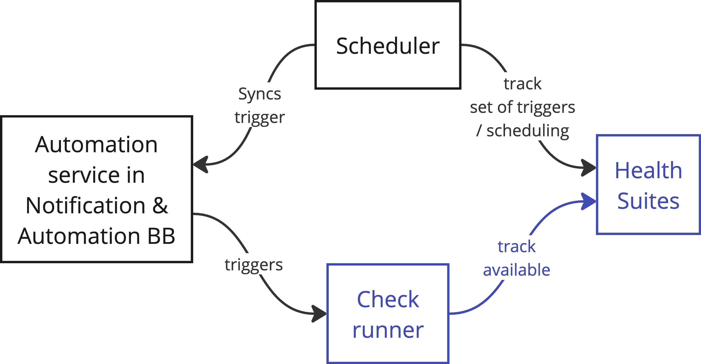

# Level 3
The final level of additional functionality is to ensure the timely execution of health-check scripts according to requested schedules and triggers. This is the only level of functionality that strictly relies on the notification and automation building block.

This functionality is achieved by the custom "scheduling and execution" service of the resource health building block ensuring that there are sufficient automations registered in the automation service of the notification and automation building block. The necessary automations consist of triggers as specified by the health-check scripts and the automation action/notification to trigger the corresponding (registered) health-check script in the resource health building block.

