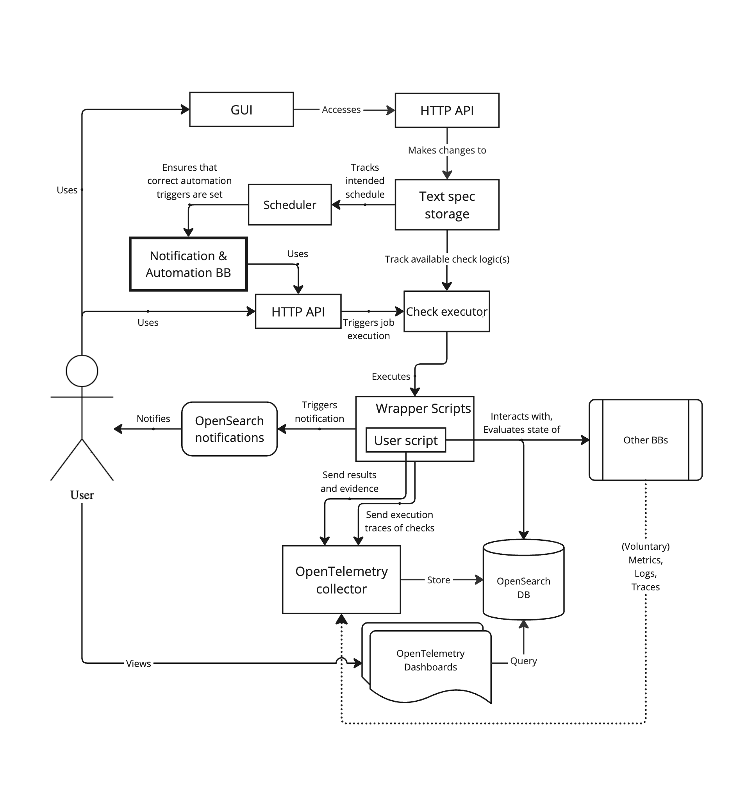
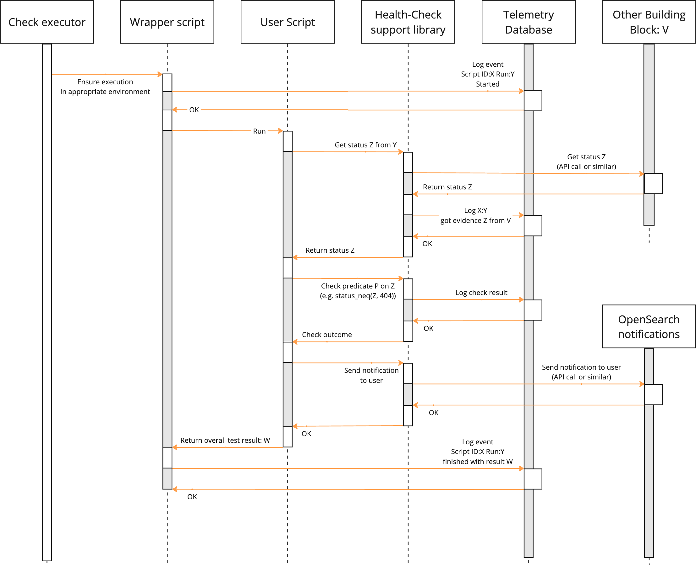

# Architecture

Proposed architecture diagram:

In short, this architecture can be separated into four levels of operation:
* Core – Support library for writing health checks and a wrapper that ensures each check is recorded;
* Level 1 – Connect core to a telemetry database for recording inputs, results and metadata of health checks run;
* Level 2 – Centralised storage, management and means to run all user scripts run through the executor;
* Level 3 – Integration with the automation service and manual triggers to ensure the scripts can be executed on an intended schedule and upon manual request.

