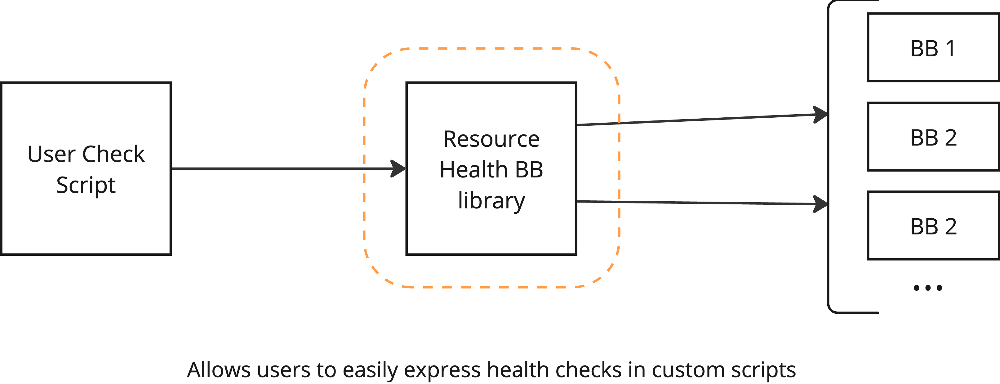

# Design overview

The resource health building block deals with health checks. These checks are typically recurrent, running on a regular schedule or in response to irregular events (such as whenever a user manually requests it). As far as the resource health building block is concerned, a health check is anything that produces a number of *traces* in [the sense of the OpenTelemetry specification](https://opentelemetry.io/docs/concepts/signals/traces/), containing one or more [spans](https://opentelemetry.io/docs/concepts/signals/traces/#spans) marked as being health check telemetry (through [span attributes](https://opentelemetry.io/docs/concepts/signals/traces/#attributes)).

TODO: Sketch example picture of a trace

A span representing a health check outcome may contain [attributes](https://opentelemetry.io/docs/concepts/signals/traces/#attributes), [events](https://opentelemetry.io/docs/concepts/signals/traces/#span-events), or child spans (recursively containing attributes, events, or child spans) that contain evidence of unhealth. For example, a HTTP request performed as part of the check may return a 500 Internal Server Error response, an exception may have been generated, or an expectation expressed as an assertion may have been violated. Any given health check outcome either contains some such evidence or it does not, in the latter case the subject(s) of the check is/are presumed healthy.

TODO: Sketch example picture containing one healthy and one or more examples of unhealthy check telemetry

Relative to the above, monitoring the health of a platform means:

1. Ensure some sufficient set of health checks are actually executed (thus producing appropriate *traces and spans*).
2. Ensure appropriate stakeholders are made aware of and can inspect the health check telemetry, especially in case evidence of unhealth is present.

The resource health BB itself does not itself prescribe precisely *which* health checks are to be run. End-users, platform operators, and developers must themselves describe the precise suite(s) of checks and their cadences. What the resource health BB does provide is:

1. [A (scripting) framework for expressing health checks](#health-check-framework) combined with a mechanism for executing such health check specifications such that appropriate *traces and spans* are generated;
2. [A standard deployment template for transmitting, storing, and notifying based on the generated *traces and spans*](#health-check-telemetry-transmission-and-storage);
3. [A plugin-based library for accessing health-check telemetry](#health-check-telemetry-access-library) (i.e. OpenTelemetry Trace data) with a back end implementation compatible with 2.;
4. [A plugin-based library for registering and configuring health-checks to be run](#health-check-management-library) with a bookend implementation mapping directly to Kubernetes resources;
5. [Interface(s) that tie together and expose the functionalities of 3. and 4.](#interfaces) via browser based graphical interactions, REST API, and CLI tools (e.g. for use with CI/CD for GitOps-style management of health checks). 

TODO: Draw out the structural composition and information flow in the above

A platform operator can choose either to use all of the above components (to achieve full functionality), skip some components (to operate the building block with reduced functionality), or replace components by some more appropriate to their platform. Details of each component can be found in their respective sub-sections in [the following section](#component-details). For an overview of potential customisation scenarios, see the [section on customisation](#potential-customisations).

## Component details

### Health check framework

At its core, the Resource Health BB provides a health-check support library for expressing health-checks, using a standard scripting language, and an executor for ensuring the correct setup for running and collecting the results of a single such script. The choice made here is to simply augment and adapt the Pytest framefork, as Pytest already provides much of the necessary functionality: expressing expectations about pieces of data and collating whether or not such expectations are satisfied for a particular run.

Assuming some minimal amount of setup and authentication, it is intended that a single such script could even be executed locally on the computer of the end-user. We will refer to this as level 0/core functionality, which can be achieved with no or only minimal centralised services on the platform (beyond the functionality being checked).

For example, an end-user can run a health-check script that checks that a published application endpoint is responding much the same way they would issue a ping command to check the up time of another host machine.
"code free" health-checks are achieved by simply writing reusable scripts that take necessary parameters as input arguments.

The framework will provide a means to make relevant requests (e.g. HTTP requests for REST APIs) that attach the necessary headers to trace the request beyond the boundaries of the resource health BB if the target server also implements OpenTelemetry distributed tracing. This provides a means for other BBs (or other subjects of health checks) to generate additional debug information (on a voluntary basis) that remains traceable to the original health check execution.



The current implementation uses [PyTest](https://docs.pytest.org/en/stable/), with special instrumentation to produce the appropriate spans and traces. The primary way to execute the checks is currently is to use a Kubernetes CronJobs, though that can be replaced by some other implementation easily. The checks are primarily created from check templates, usually by specifying what Pytest script to run, and what are its dependencies, or by specifying the parameters to use for a platform-operator-defined script. The platform operators also define the check templates, and implement Python hooks to specify the exact configuration and authentication details.

For example, the following defines a check which reads `RESOURCE_CATALOGUE_ENDPOINT` from an environment variable and checks that the enpoint returns OK to a simple ping.

```python
from os import environ
import requests

RESOURCE_CATALOGUE_ENDPOINT: str = environ["RESOURCE_CATALOGUE_ENDPOINT"]


def test_ping_resource_catalogue() -> None:
    response = requests.get(
        RESOURCE_CATALOGUE_ENDPOINT,
    )
    assert response.status_code == 200
```

### Health check telemetry transmission and storage

When a health check is executed (typically using the [framework described above](#health-check-framework)) it generates OpenTelemetry trace information describing the check execution and its outcome (see [the introduction](#design-overview)). If executed manually, the check telemetry can in principle be inspected directly by the executing user. In practice, though, it is expected that most or all health checks are executed in an automated fashion and that the telemetry needs to be persisted for some time for inspection either in an aggregate fashion ("how often do my checks run/fail?") or for individual debugging ("what were the details of that check execution that failed last week?").

The [health check framework](#health-check-framework) simply expects an OpenTelemetry-compatible endpoint to be provided. In order to cover the persistence needs outlined above, the resource health building block also includes a reference deployment that provides an OpenTelemetry-compatible endpoint backed by a database for persisting trace information sent to that endpoint. It also serves as an endpoint for other services (that are subjects of a health check) to provide additional information (in the form of OpenTelemetry signals) about the health check execution, on a voluntary basis.

It is also expected that typical deployments will need some form of autonomous alerting if evidence of unhealth is present. This reference deployment will also provide a mechanism to generate a trigger whenever such evidence arrives.


The current implementation uses a Kubernetes setup of the [OpenTelemetry collector](https://opentelemetry.io/docs/collector/) configured to persist trace data in [OpenSearch](https://opensearch.org/) with the [ss4o schema](https://opensearch.org/docs/latest/observing-your-data/ss4o/). The collector provides the OpenTelemetry endpoint used by the health check framework while OpenSearch provides the long term storage and access capability to the generated traces.

The triggering functionality is intended to be built around the native alerting functionality of OpenSearch, or a custom secondary listener service will be written and attached as a secondary sink of the OpenTelemetry collector. This listener service would be a simple application that matches incoming span data against a pre-configured pattern and generates an event (e.g. through a web hook) when a matching span arrives. This secondary solution is expected to be less flexible for the end-user, but not significantly more complex to implement.

### Health check telemetry access library

Once health check telemetry is persisted either [using the reference method included in the resource health building block](#health-check-telemetry-transmission-and-storage) or [in a platform specific manner](#otel-collector) it will have to be inspected in order to be useful. In principle this can be performed directly against whatever storage mechanism (e.g. database) the platform has chosen to deploy (such as the [reference one using OpenSearch provided by the building block](#health-check-telemetry-transmission-and-storage)) with whatever front-end the platform developers deem appropriate.

In order for us (the resource health building block developers) to be able to provide some "default" front-end functionality that is reusable, we have created a small library that defines an abstract interface for accessing OpenTelemetry trace data sufficient for our purposes.

We also provide an implementation of that abstract interface for accessing data stored [by the reference mechanism provided by the building block](#health-check-telemetry-transmission-and-storage). A platform provider choosing to use another storage mechanism/format/schema would have to provide their own implementation of this interface, which is intended to be kept small and simple to implement.

There is a web UI for health check management and generated telemetry inspection which is the primary client application for the telemetry interface. There is also a health check template which allows creating health checks which use this interface to inspect the previously generated telemetry.

### Health check management library

Health checks can in principle be executed in an ad-hoc manner, as long as they are capable of transmitting the resulting OpenTelemetry trace information to the necessary endpoint. That being said, most platforms that utilise (at least some part of) the resource health building block are expected to need some form of mechanism for registering health checks together with some meta-data (at least some persistent name) in a way that allows them to be easily executed on or outside of a specified schedule. 

As is the case with [health check telemetry](#health-check-telemetry-access-library) this can in principle be handled by the target platform in a platform-specific way. In order for the the resource health building block to provide some reusable "default" front-end functionality related to the management of health checks, it includes a small library that abstracts a minimal necessary interface. The core part of this interface is intended to enable CRUD (Create, Read, Update, Delete) operations on health checks, as well as requesting the execution of checks (ad-hoc or on schedule).

For platforms that do not require the use of a custom workflow engine/scheduler/etc for the execution of health checks, the building block includes an implementation of this library that maps health checks directly to Kubernetes resources (CronJobs) using the Kubernetes API. 

### Interfaces

Finally the building block provides some reusable and generic front-end functionality that is intended to be used in the absence of platform-specific interfaces. 

These interfaces relatively directly expose the functionality provided by the [telemetry access library](#health-check-telemetry-access-library) and the [health check management library](#health-check-management-library) through:

- A CLI interface (for use by humans and in CI/CD for GitOps-type management);
- A REST-type remote interface (for integration with other software and as a proxy for the CLI); and
- A graphical web-interface (for use by humans).

The details of these interfaces are intended to iterated on in an iterative fashion with end-users.

## Potential Customisation

What follows is a list of ideas of ways in which platform operators may choose to modify or customise the design of the resource health BB as outlined above.

### otel-collector

The standard deployment template relies on a single deployment of OpenTelemetry collector as an ingestion endpoint. Each check execution writes directly to this centralised OpenTelemetry collector. If a platform either requires a more complex topology for transporting trace data or already has a separate infrastructure for dealing with observability data (an independent otel-collector, FluentBit, Vector, ...) this can be accommodated by simply specifying the appropriate OTLP (OpenTelemetry Line Protocol) endpoint, which might, for example, be an appropriately configured sidecar container, injected by the target cluster. 

This also makes it easy to "siphon off" health check telemetry into an auxiliary system for more advanced analysis monitoring (e.g. to some Application Performance Monitoring software).

### OpenSearch

The building block simply relies on OpenTelemetry trace data being stored somewhere, in a form the health-check telemetry library knows how to access. The library has a minimal API that maps directly to concepts from the OpenTelemetry standard (i.e. allows to query traces and spans based on specified filtering conditions). Thus adding support for a new back end (capable of storing OpenTelemetry trace data) should be a matter of implementing just a few query functions, roughly `query_spans_page(from_time, to_time, span_ids resource_attributes, scope_attributes, span_attributes, span_name)`, where `span_ids` is a list of `(trace_id, span_id)`, and `resource_attributes`, `scope_attributes`, `span_attributes` specify the filtering attributes.

### Health checks based on Python scripts

The primary assumption of a health check is that it is some workflow/process that produces OpenTelemetry trace data, to a specified OTLP endpoint. The core mechanism proposed in the building block for expressing and executing health checks (an instrumented PyTest test suite) could thus be replaced by any process that can (be instrumented to) produce appropriate trace data and send it to an OTLP endpoint.

### User interfaces

All user interfaces (graphical, REST, CLI) are intended to expose simply the abstractions provided by the health-check execution and health-check telemetry libraries without being essential to them. If relying, for example, on the Kubernetes based management of health checks the platform (or individual users) can choose to directly manage the relevant CronJob resources (which are intended to be fairly straightforward).
