# Tutorials

Tutorials as a learning aid.

Note that all the links in the tutorial are for the development cluster, and you need to authenticate as one of the three standard users to create checks and view their results.
In other deployments the links will be different. I will also note all deployment dependant aspects as they come up. 

## Basic tutorial for users

In this tutorial you will learn:

* What a health check is
* How to navigate the Health Check Web UI
* How to define a simple health check
* How to specify when the check runs (or run it on demand)
* How to view the health check generated telemetry and diagnose simple issues from it

You should follow along the following steps to get used to how things work.

1. Go to the Health Check website [https://resource-health.apx.develop.eoepca.org/](https://resource-health.apx.develop.eoepca.org/). As noted above, you should log in as one of the standard users.
2. Click on `Create new check`.
   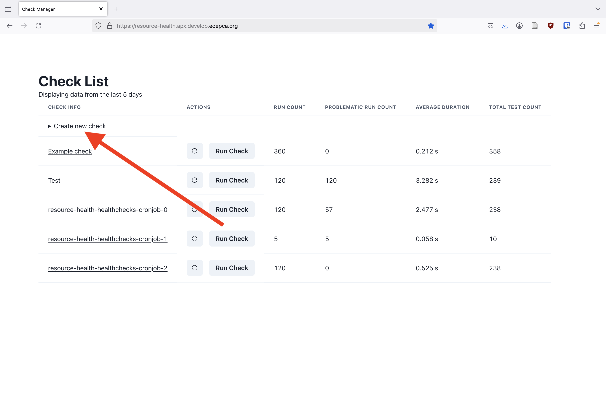
   Platform operators configure what kinds of checks you can create. You choose the check kind by picking a check template. For example, in the reference deployment you can choose `Generic script template`, and the check will be a Python script you provide (we will take a look at that later in an advanced guide). For now, we will choose `simple ping template`, which will create a check which pings an endpoint that we specify, and checks that the return code is as specified.  
   From the dropdown shown below choose `simple ping template` check template (keep in mind that the platform might be configured to not have a check template exactly like this - the name of check template might be different, or it might not even exist, for example)
   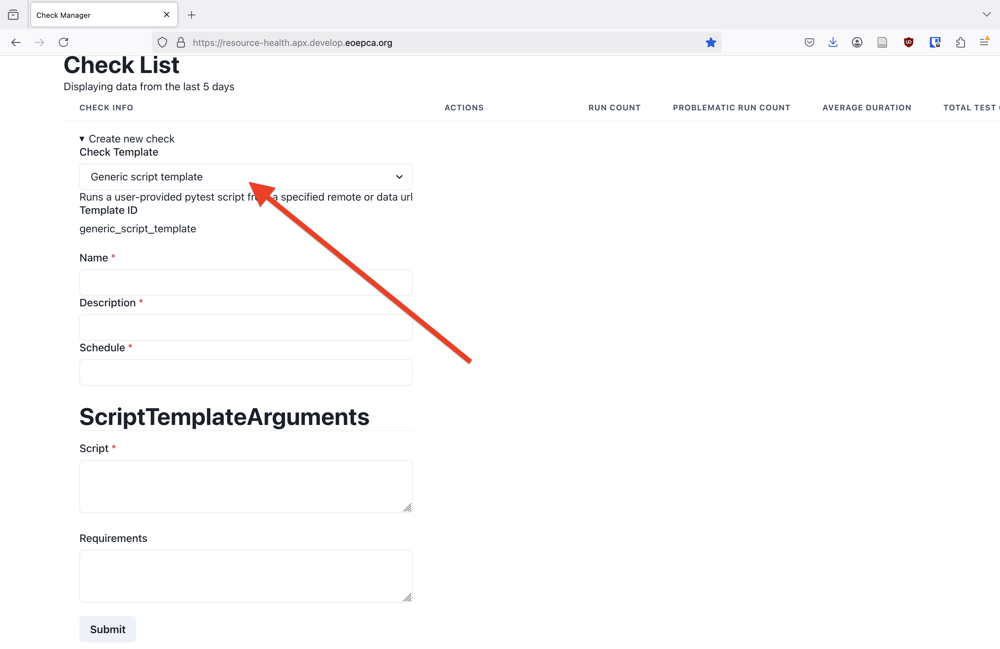
   Enter the values as you see below
   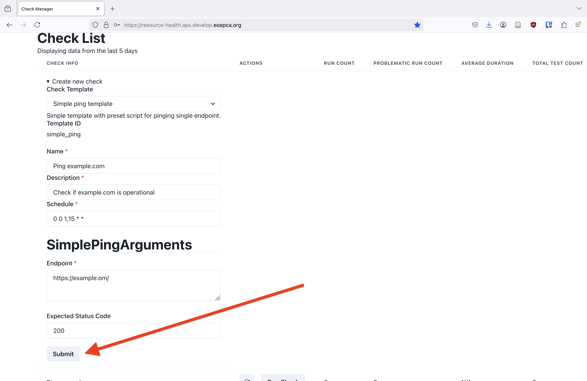
   Note that `https://example.om/` deliberately contains a typo for us to see how to debug errors.  
   `schedule` is a CRON-style schedule specifying when the health check is to be executed. The schedule `0 0 1,15 * *` means the check will run `At 00:00 on day-of-month 1 and 15`. See [Cron Schedule](#cron-schedule) for more detailed information.
   Then click submit.
3. After submitting the check, click on `Create new check` again, to hide the check creation form.  
   `Ping example.com` (or however you named it) should now be visible somewhere in the list, usually near the top.  
   Since the new check hasn't executed yet, all the stats in the table show empty values for it. By clicking `Run Check`, the check will be executed in the background. Pressing the reload button (**&#10227;**) refreshes the telemetry for this check, updating the displayed statistics. Once `Run count` indicates that the check executed, we should also see `problematic run count` indicating the something went wrong. This is to be expected, as we deliberately introduced a typo. Click on the check to get more details on its executions.
   
4. When a check name is pressed, a page describing that particular check should open. Scroll to the bottom of the page. It should look something like below.
   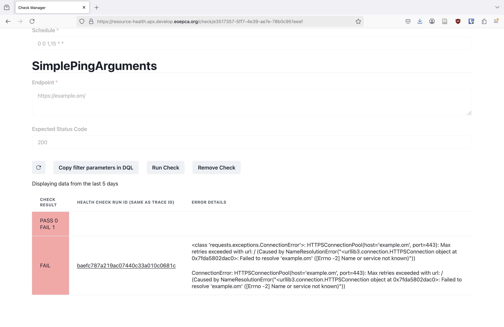
   In particular, you can see the error message, the end of which is
   ```
   Failed to resolve 'example.om' ([Errno -2] Name or service not known)"))
   ```
   We see that it couldn't ping `example.om` as no such domain exists.
5. We conclude that we defined the check incorrectly. We will remove it, and create a new one without the typo. Click on `Remove Check`. Confirm check removal when the pop-up appears.
   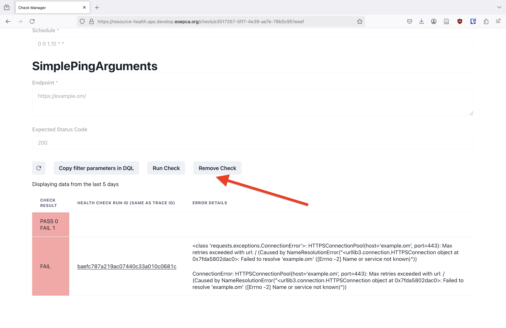
6. Now go create the check using step 2. but without the typo, of course. Then go do step 3. and 4., the check should now run successfully.
   Below is how the website home page should look when the check run succeeds, and after that how the individual check page should look.
   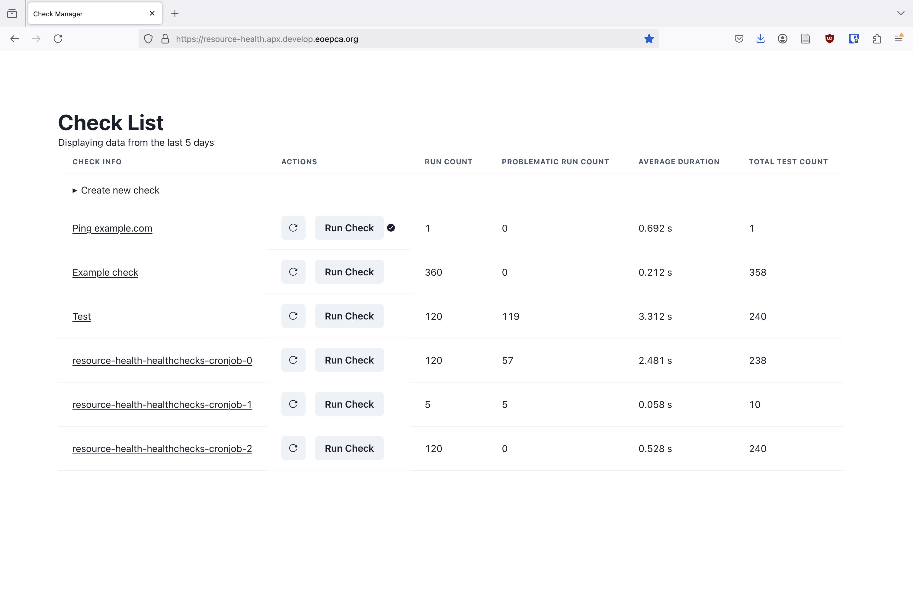
   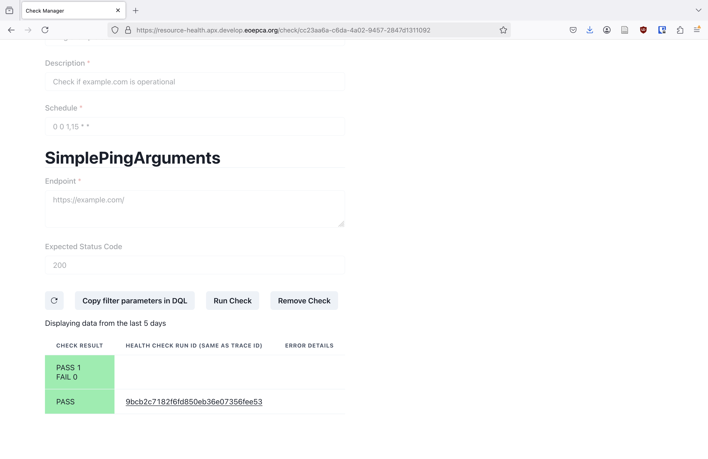

<!-- TODO: add an OpenSearch dashboards visualization here? -->

## Advanced tutorial for users

In this tutorial it is assumed that you are familiar with the basics, such as having followed [Basic tutorial for users](#basic-tutorial-for-users)

In this tutorial we will learn:

* How to define more complex health checks
* How to inspect detailed check telemetry
* How to use detailed check telemetry

Follow along the following steps:

1. Go to the Health Check website [https://resource-health.apx.develop.eoepca.org/](https://resource-health.apx.develop.eoepca.org/). Again, you should log in as one of the standard users.
2. We will create a health check which will execute the Python script below using the [Pytest](https://docs.pytest.org/en/stable/) testing framework.
   ```python
   import random
   import pytest

   ## Utility functions that will be moved into library

   from opentelemetry import trace
   from opentelemetry.util import types
   def report_custom(attributes: dict[str, types.AttributeValue]) -> None:
       cur_span = trace.get_current_span()
       cur_span.set_attributes(attributes)

   # USER DEFINED CODE START

   def test_that_generates_custom_telemetry1() -> None:
       ## Something returned by a service, or similar
       outcome = random.random()
       report_custom({"resourcehealth.example.random_outcome": outcome})
       assert outcome <= 1

   def test_that_generates_custom_telemetry2() -> None:
       ## Something returned by a service, or similar
       outcome1 = random.random()
       outcome2 = random.random()

       ## To simplify filtering when you have multiple
       ## values, include a "has_xyz"
       report_custom(
           {
               "resourcehealth.example.has_outcome": True,
               "resourcehealth.example.random_outcome1": outcome1,
               "resourcehealth.example.random_outcome2": outcome2,
           }
       )
       assert abs(outcome1 - outcome2) <= 1
   ```
   See [Health Check Script](#health-check-script) for more details about health check scripts, and [Setting Up a Development Environment](#setting-up-a-development-environment) to ease health check development.  
   Create new check just like before. This time you should use `generic script template`. Set `Name`, `Description`, and `Schedule` to whatever you like (see [Cron Schedule](#cron-schedule) for a refresher on scheduling). Then input 
   ```
   https://gist.githubusercontent.com/tilowiklundSensmetry/aa8a28ab9bc432b8a76635a238c9aa11/raw/9dc5847959a909ffbaeb1a9239bbf10ad442266f/test_producing_custom_data.py
   ```
   in the `Script` field (this is a link to the script above). Alternatively, you could put the script encoded as a Data URL in there, see [Data URL](#data-url) for details.
   The check creation should look something like this
   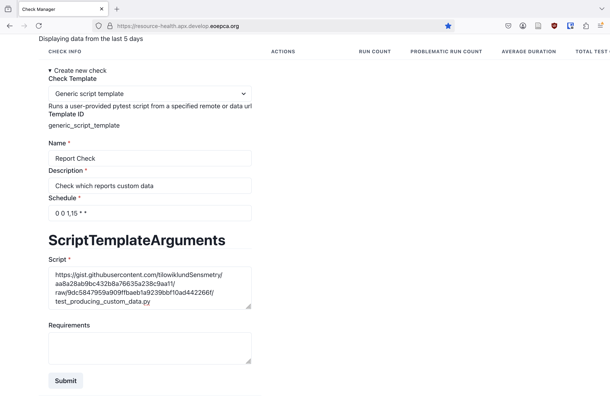
   Click `Submit`
3. Run the check once, just as before. The check should succeed. Now go to the check results table and click on the check run ID. A page with the raw telemetry (like below) for that check run should open up - in here you see what information is stored about each check run in the database.
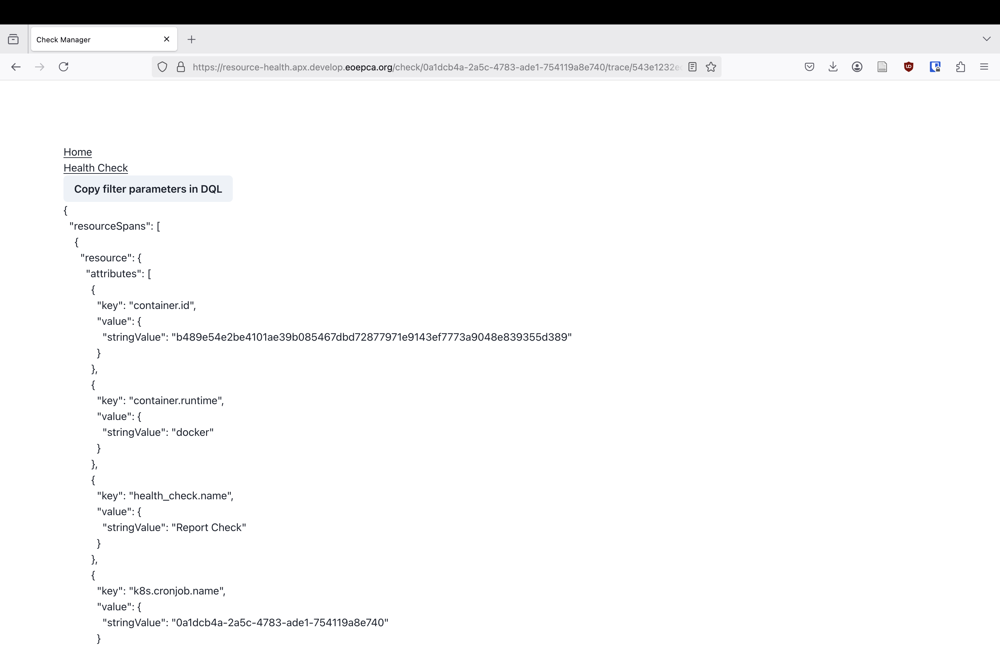
See [Raw Health Check Telemetry](#raw-health-check-telemetry). In particular, you can search (with ctrl + F) for `resourcehealth.example.random_outcome` or `resourcehealth.example.random_outcome1` and see those results.
4. We will now see one way to use the detailed health check telemetry. We will create a health check which looks into the telemetry generated from the above checks and verifies that the results from above overall are as expected. The check code is shown below
   ```python
   from datetime import timedelta
   from statistics import median
   import pytest

   ## Utility functions that will be moved into library

   from typing import Any
   from opensearchpy import AsyncOpenSearch
   import asyncio

   from python_opentelemetry_access.proxy import Proxy
   from python_opentelemetry_access.proxy.opensearch.ss4o import OpenSearchSS40Proxy


   def get_opensearch_proxy() -> Proxy:
       opensearch_params: dict[str, Any] = {}
       opensearch_params.update({"verify_certs": False, "ssl_show_warn": False})
       client = AsyncOpenSearch(
           # hosts=[{"host": "opensearch-cluster-master-headless", "port": 9200}],
           hosts=[{"host": "127.0.0.1", "port": 8080}],
           use_ssl=False,
           **opensearch_params,
       )
       return OpenSearchSS40Proxy(client)


   @pytest.fixture
   def telemetry_proxy() -> Proxy:
       proxy = get_opensearch_proxy()
       yield proxy
       async def proxy_close():
           await proxy.aclose()
       asyncio.run(proxy_close())

   # USER DEFINED CODE START

   @pytest.mark.filterwarnings("ignore:enable_cleanup_closed.*:DeprecationWarning")
   def test_that_inspects_custom_telemetry1(telemetry_proxy: Proxy) -> None:
       previous_outcomes = [
           span.attributes["resourcehealth.example.random_outcome"]
           for span in telemetry_proxy.load_span_data_sync(
               span_attributes={
                   # None means "any value" for now, will change
                   "resourcehealth.example.random_outcome": None
               },
               max_data_age=timedelta(weeks=4),
           )
       ]

       print(f"random_outcomes: {previous_outcomes[:10]}{'' if len(previous_outcomes) < 10 else '...'}")

       assert len(previous_outcomes) > 0
       assert median(previous_outcomes) < 0.8

   @pytest.mark.filterwarnings("ignore:enable_cleanup_closed.*:DeprecationWarning")
   def test_that_inspects_custom_telemetry2(telemetry_proxy: Proxy) -> None:
       previous_outcome_diffs = [
           span.attributes["resourcehealth.example.random_outcome1"]
           - span.attributes["resourcehealth.example.random_outcome2"]
           for span in telemetry_proxy.load_span_data_sync(
               span_attributes={
                   "resourcehealth.example.has_outcome": [True],
               },
               max_data_age=timedelta(weeks=4),
           )
       ]

       print(f"random_diffs: {previous_outcome_diffs[:10]}{'' if len(previous_outcome_diffs) < 10 else '...'}")

       assert median(previous_outcome_diffs) - min(previous_outcome_diffs) < 1.8
       assert max(previous_outcome_diffs) - median(previous_outcome_diffs) < 1.8
   ```
   Create a new check just like before, and put
   ```
   https://gist.githubusercontent.com/tilowiklundSensmetry/47d5a9bb2a9aa66ca4cfc71ba70814ff/raw/43f04c63aae58838b0de5211b35ca339328b3678/test_consuming_custom_data.py
   ```
   in the `Script` field.  
   Click `Submit`
5. So that this check has more data to inspect, run the previous check a few times manually (you don't need to wait for previous check run to finish before running the check again). Then run the current check once. As the quantities `random_outcome`, `random_outcome1`, `random_outcome2` are randomised, the aggregate check might or might not succeed, but the more times the original check runs, the more likely the aggregate check to succeed. That's it!

## Tutorial for platform administrators

The two most important configuration parts are defining hooks and check templates.

### Health Check Templates

Coming soon.

### Hooks Tutorial

In this tutorial we will learn:

* How to configure authorization for Health Check API using hooks

Hooks are Python functions which are called by the APIs and by their backends to get the configuration information and to ask if a certain action is allowed. See [Hooks Documentation](#hooks-documentation), [Health Check API Backend](#health-check-api-backend), and [Telemetry API Backend/Proxy](#telemetry-api-backendproxy).

Here is how you would forbid some user (eric in this case) from creating a ping-an-endpoint check. Your deployment might differ from the development cluster which is referenced below, but the steps should translate well to your deployment:

1. If we can, we should first check that eric can create a ping-an-endpoint check right now. So that when we're done and eric can't create a ping-an-endpoint check any more, we know it's because of what we did, and not some unrelated reason.
2. We first need to figure out what hook to implement. Since we want to configure something about check management (as opposed to telemetry management), we'll need to update the Health Check API configuration. Then we take a look at [Health Check Hooks Example Implementation](https://github.com/EOEPCA/resource-health/blob/58087ff26eca34e6aeaf58216fd87b18b745e36b/check_manager/example_hooks/oidc_auth/auth_hooks.py) to see what hooks are available, and example implementations for each of them. Check lifecycle hooks are named `on_template_...` or `on_check_...`. We see that `on_check_create` hook is what we can use for this. As the name suggests, it's called before any check is created, so it's a good place to forbid check creation when conditions of our choosing aren't met.

    !!! note
        `on_template_access` hook could also be used for this, but updating it would make it difficult for eric to understand the details of existing ping-an-endpoint checks, as to understand what check parameters mean it helps to have access to the check template from which the check was created.
        Also he couldn't inspect an existing ping-an-endpoint check in the web UI, as it relies on having access to the check templates from which the check was created.

3. We now need to figure out what the check template id is from which ping-an-endpoint checks are created. We go to where the current deployment check templates are synced from. For the development cluster, it is [here](https://github.com/EOEPCA/eoepca-plus/blob/549c1d6ff43ce442cc88c56125f6fb9468854e0e/argocd/eoepca/resource-health/resource-health.yaml#L342) (where `templates:` is). We see [here](https://github.com/EOEPCA/eoepca-plus/blob/549c1d6ff43ce442cc88c56125f6fb9468854e0e/argocd/eoepca/resource-health/resource-health.yaml#L368) that the template id is `simple_ping`.

4. Now we go to where the current deployment hooks are synced from. For the development cluster, it is [here](https://github.com/EOEPCA/eoepca-plus/blob/549c1d6ff43ce442cc88c56125f6fb9468854e0e/argocd/eoepca/resource-health/resource-health.yaml#L187) (we just look at the `hooks:` part of the `check_api`).

5. To actually code the hook changes it is recommended that you clone [Resource Health repo](https://github.com/EOEPCA/resource-health), open `check-manager` directory, and set up your development environment in by following [Setting Up a Development Environment](#setting-up-a-development-environment) section to have the IDE and type checking support. Then copy the existing hooks we've found in the step above to a Python file here. We fill edit this file, and when we're satisfied with the changes, we'll copy them (or otherwise sync them) to where the actual hooks are defined.

6. We will now update (or create) `on_check_create` hook to disallow eric to create a health check from the `simple_ping` template.

    Depending on whether `on_check_create` is already defined, we either modify or create it. Then, in the implementation of the `on_check_create` function we implement the additional condition

    ```python
    if userinfo["username"] == "eric" and check.metadata.template_id == "simple_ping":
        raise hu.APIForbiddenError(
            title="Check creation disallowed",
            detail="You are not authorized to create this check",
        )
    ```
    
    So the final `on_check_create` would look something like this
    
    ```python
    def on_check_create(userinfo: UserInfo, check: hu.InCheckAttributes) -> None:
        
        # The previous if-statements go here

        if userinfo["username"] == "eric" and check.metadata.template_id == "simple_ping":
            raise hu.APIForbiddenError(
                title="Check creation disallowed",
                detail="You are not authorized to create this check",
            )
    ```

    The `userinfo` argument is whatever info is produced by the `on_auth` hook.

7. Push the updated hooks. Then we either manually sync the changes or wait for automatic syncing. When you see that your changes are visible in the resource health deployment manifest, restart the `resource-health-check-api` **service** (the icon should be as in the image below). 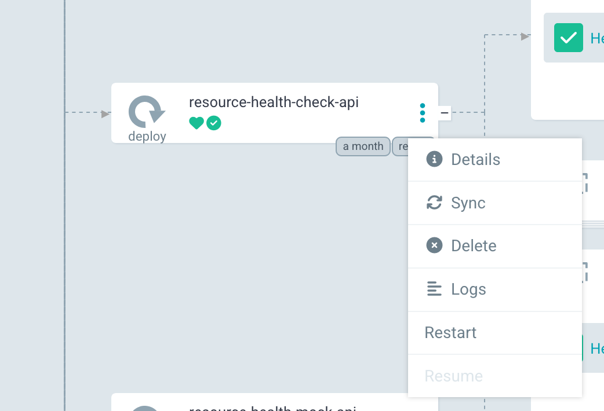.

8. Now we're done! If possible, we should check that eric can no longer create a ping-an-endpoint check (he should get an error like `Check creation disallowed (code 403): You are not authorized to create this check`), and that other users still can.

## Appendix

### Cron Schedule

`schedule` is a CRON-style schedule specifying when the health check is to be executed. The schedule `0 0 1,15 * *` means the check will run `At 00:00 on day-of-month 1 and 15`. You can go to [https://www.baeldung.com/cron-expressions](https://www.baeldung.com/cron-expressions#cron-expression) to learn about Cron expression syntax, and to [https://crontab.guru](https://crontab.guru/#0_0_1,15_*_*) to see an explanation for your own schedule expression.
!!! warning
    Not all tools which support CRON schedule expressions support exactly the same syntax. Some tools support more than the 5 standard parts of the expression, for example.

### Setting up a development environment

1. [Install uv](https://docs.astral.sh/uv/#installation).
2. Go to the subdirectory where the project is - one of `pytest-health` (to see example health checks or develop one of your own), `check_manager`, `mock/service`, `plugin-utils` (as [Resource Health repo](https://github.com/EOEPCA/resource-health) is a monorepo, with each subdirectory generally being a separate project).
3. The following installs all dependencies and a suitable Python version in a virtual environment `.venv` placed in the current working directory.
    1. If you're in `pytest-health`, run `uv venv --python 3.12 && uv pip install -r runner-image/base_requirements.txt`.
    2. Otherwise run `uv sync`.
4. If you IDE support, you should point your IDE to use the Python from the virtual environment. For example, in vscode should do that automatically, or give a popup 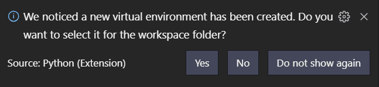 where you should select `Yes`.

    !!! note
        Some vscode extensions (such as Ruff) need to be reloaded for them to pick up a newly created virtual environment

5. You should also consider enabling mypy type checking in your IDE. For example, in vs code(ium) install [Mypy extension](https://marketplace.visualstudio.com/items?itemName=matangover.mypy), and set `mypy.runUsingActiveInterpreter` setting to `true`. This will mean that mypy uses the virtual environment to run, just like Python, and will be able to see all the installed dependencies properly.
    1. If you're in `pytest-health`, you also need to install mypy into the virtual environment by running `uv pip install mypy`
6. You can now run code with `uv run <the-usual-command>`, e.g. to run a health check use `uv run pytest <path-to-check.py>`

    In particular, you can type check using mypy by running `uv run mypy my_file.py`.

### Health Check Script

By default, health checks are just Python tests using [Pytest framework](https://docs.pytest.org/en/stable/), with some helper functionality provided by Resource Health BB. In principle, any program in any language could be considered a health check as long as it generates appropriately annotated [Opentelemetry](https://opentelemetry.io/docs/concepts/signals/traces/) traces upon execution, but Resource Health BB currently only provides means to execute Pytest-based checks.

!!! warning
    Test function names must start with `test`, and test class names must start with `Test`.

#### Getting Started

To get a simplest check going all you need to do is have a Python function starting with `test`, and use `assert` to check that results are as you expect, for example
```python
import requests

def test_simple_ping() -> None:
    response = requests.get("https://example.com/")
    assert response.status_code == 200
```

#### Check features

In the check file you can import any Python packages (though you need to specify them in requirements.txt field when you create the check in the website, for example) and use any Python 3.12 language features (such as loops, functions, match statements, etc.), and any Pytest features (such as fixtures, parametrization, etc.) in your test or outside of it. There are many great guides for writing Pytest tests, and you can also take a look at [Pytest official documentation](https://docs.pytest.org/en/stable/index.html) to learn more. For the rest of this chapter we will focus on the functionality most relevant to health checks.

The below code (also used above to create a check) demonstrates how to add some custom data to the current span. This could be used to log things like computation results to be checked for consistency among different runs later, for example.  
Just as the comments note, the top part of this will later be moved into a library.
```python
import random
import pytest

## Utility functions that will be moved into library

from opentelemetry import trace
from opentelemetry.util import types


def report_custom(attributes: dict[str, types.AttributeValue]) -> None:
    cur_span = trace.get_current_span()
    cur_span.set_attributes(attributes)


# USER DEFINED CODE START


def test_that_generates_custom_telemetry1() -> None:
    ## Something returned by a service, or similar
    outcome = random.random()

    report_custom({"resourcehealth.example.random_outcome": outcome})

    assert outcome <= 1


def test_that_generates_custom_telemetry2() -> None:
    ## Something returned by a service, or similar
    outcome1 = random.random()
    outcome2 = random.random()

    ## To simplify filtering when you have multiple
    ## values, include a "has_xyz"
    report_custom(
        {
            "resourcehealth.example.has_outcome": True,
            "resourcehealth.example.random_outcome1": outcome1,
            "resourcehealth.example.random_outcome2": outcome2,
        }
    )

    assert abs(outcome1 - outcome2) <= 1
```

The code below demonstrates checking the telemetry added by the test above.
```python
from datetime import timedelta
from statistics import median
import pytest

## Utility functions that will be moved into library

from typing import Any
from opensearchpy import AsyncOpenSearch
import asyncio

from python_opentelemetry_access.proxy import Proxy
from python_opentelemetry_access.proxy.opensearch.ss4o import OpenSearchSS40Proxy


def get_opensearch_proxy() -> Proxy:
    opensearch_params: dict[str, Any] = {}

    opensearch_params.update({"verify_certs": False, "ssl_show_warn": False})

    client = AsyncOpenSearch(
        # hosts=[{"host": "opensearch-cluster-master-headless", "port": 9200}],
        hosts=[{"host": "127.0.0.1", "port": 8080}],
        use_ssl=False,
        **opensearch_params,
    )
    return OpenSearchSS40Proxy(client)


@pytest.fixture
def telemetry_proxy() -> Proxy:
    proxy = get_opensearch_proxy()
    yield proxy

    async def proxy_close():
        await proxy.aclose()

    asyncio.run(proxy_close())


# USER DEFINED CODE START

@pytest.mark.filterwarnings("ignore:enable_cleanup_closed.*:DeprecationWarning")
def test_that_inspects_custom_telemetry1(telemetry_proxy: Proxy) -> None:
    previous_outcomes = [
        span.attributes["resourcehealth.example.random_outcome"]
        for span in telemetry_proxy.load_span_data_sync(
            span_attributes={
                # None means "any value" for now, will change
                "resourcehealth.example.random_outcome": None
            },
            max_data_age=timedelta(weeks=4),
        )
    ]

    print(f"random_outcomes: {previous_outcomes[:10]}{'' if len(previous_outcomes) < 10 else '...'}")

    assert len(previous_outcomes) > 0
    assert median(previous_outcomes) < 0.8

@pytest.mark.filterwarnings("ignore:enable_cleanup_closed.*:DeprecationWarning")
def test_that_inspects_custom_telemetry2(telemetry_proxy: Proxy) -> None:
    previous_outcome_diffs = [
        span.attributes["resourcehealth.example.random_outcome1"]
        - span.attributes["resourcehealth.example.random_outcome1"]
        for span in telemetry_proxy.load_span_data_sync(
            span_attributes={
                "resourcehealth.example.has_outcome": [True],
            },
            max_data_age=timedelta(weeks=4),
        )
    ]

    print(f"random_diffs: {previous_outcome_diffs[:10]}{'' if len(previous_outcome_diffs) < 10 else '...'}")

    assert median(previous_outcome_diffs) - min(previous_outcome_diffs) < 1.8
    assert max(previous_outcome_diffs) - median(previous_outcome_diffs) < 1.8
```

<!-- The data URL section is an exact copy (at the moment anyway) of https://github.com/EOEPCA/resource-health/tree/58087ff26eca34e6aeaf58216fd87b18b745e36b/pytest-health/runner-image#data-url.
Please keep them in sync. -->

#### Data URL

Data URLs allow encoding files as URLs. So instead of putting a file somewhere and providing a link to it for the health check definition, you can encode your file in a data URL instead. Data URL is a string `data:text/plain;base64,<data>` where `data` is base64 encoded string. One quick way to see the base64 data encoding and decoding is to use online tools such as [https://www.base64encode.org/](https://www.base64encode.org/) and [https://www.base64decode.org/](https://www.base64decode.org/) respectively.

Note that the data URLs are also supported in browsers, so you can inspect a data URL like `data:text/plain;base64,SGVsbG8gd29ybGQh` by opening it in a browser as if it was any other URL. The above data URL encodes `Hello world!` by the way.

See [Data URL](https://developer.mozilla.org/en-US/docs/Web/URI/Reference/Schemes/data) for more.

#### Health Check API backend

Health Check API by itself doesn't know how to fulfill any of its functions, like listing checks, creating checks, running checks, etc. That's where backends come in - they tell the API how to perform all those actions. Currently the following backends are implemented:
* K8s backend. It is the main backend, and the only backend which knows how to actually execute the health checks. In [Health Check Templates section](#health-check-templates) you learn how to specify check templates for K8s backend specifically.
* REST backend. It takes an already running Health Check API endpoint and uses it to execute all the API actions. Mostly used by the command line interface, as the CLI often runs on a machine which doesn't have direct access to a K8s cluster.
* Mock backend. As the name suggests, mostly used for testing.

#### Telemetry API backend/proxy

Just like Health Check API, the Telemetry API by itself doesn't know how to fulfill any of its functions, like like listing spans and applying filtering. The backends/proxies tell the API how to do perform those functions. Currently the following backends/proxies are implemented:
* Opensearch SS4O. It is the main backend. Takes telemetry data from an OpenSearch database.
* Mock Proxy. Takes telemetry from file. Mostly used for testing, but could also be used to make data available from a no-longer-used database by putting that data into a file first

#### Raw Health Check Telemetry

Raw check telemetry is just OpenTelemetry traces in [OTLP/JSON](https://opentelemetry.io/docs/specs/otlp/#json-protobuf-encoding) format, with a resource attribute `user.id` set to the user id who is entitled to view the trace. The `user.id` is used to decide if a user is authorized to view that specific trace.

Health check is considered failing if the OTEL trace produced from the check execution contains evidence of unhealth, which by default means if it contains a span with [span status](https://opentelemetry.io/docs/concepts/signals/traces/#span-status) being `Error`. This is encoded as `"status": { "code": 2 }` in the span.

You can read more about distributed tracing in OpenTelemetry [here](https://opentelemetry.io/docs/concepts/observability-primer/#understanding-distributed-tracing) (For now we don't have log support, so you should skip that part).


### Hooks Documentation

Here we will learn:

* How to configure Health Check API and Telemetry API backends using hooks
* How to configure Health Check API and Telemetry API authentication using hooks
* How to make authorization decisions for Health Check API and Telemetry API
* How to disallow actions for any other reason, e.g. disallow creating checks with too frequent schedules

Hooks are Python functions which are called by the APIs and by their backends to get the configuration information and to ask if a certain action is allowed. For more about API backends, see [Health Check API Backend](#health-check-api-backend) and [Telemetry API Backend/Proxy](#telemetry-api-backendproxy).

The following hook parts are common for both Health Check API and Telemetry API hooks:

1. `UserInfo` type definition. You will produce a value of this type upon inspecting the user authentication data, and you will use it later on to make authentication decisions such as "Bob gets to use this check template and Alice does not".  
    Note that Python is dynamically typed, so you don't have to do this, but it shows your tooling what you expect, and thus the tooling (such as mypy) can point to your mistakes before executing the code.
    <!-- TODO: add a note of how to set up stuff to get type checking of hooks code. -->
    For example
    ```python
    class UserInfo(TypedDict):
        userid: str
        username: str
        access_token: str
        refresh_token: str | None
    ```
2. The hooks themselves, which are just python functions with certain names and signatures. The following hooks need to be defined for both Health Check API and Telemetry API.
    1. `get_fastapi_security`. Returns a function (or a callable class, see explained [here](https://stackoverflow.com/a/111255)), which takes a request object and returns authentication data from it. In the example below, the authentication data has `auth`, `id`, `refresh` tokens or `None`. You must implement this hook if you want the other authorization hooks to be able to make authorization decisions.
    For example
    ```python
    def get_fastapi_security() -> OIDCProxyScheme:
        return OIDCProxyScheme(
            openIdConnectUrl=os.environ["OPEN_ID_CONNECT_URL"],
            audience=os.environ["OPEN_ID_CONNECT_AUDIENCE"],
            id_token_header="x-id-token",
            refresh_token_header="x-refresh-token",
            auth_token_header="Authorization",
            auth_token_in_authorization=True,
            auto_error=True,  ## Set False to allow unauthenticated access!
            scheme_name="OIDC behind auth proxy",
        )
    ```
    2. `on_auth`. Takes the authentication data produced by calling the function (or callable class) returned from the `get_fastapi_security` hook. Decides if user is authorised to use the API (raises an exception if they aren't), creates `UserInfo` object which stores the relevant user authentication information, such as username, access token, etc. This function must also be implemented to make authorization decisions later on.
    For example
    ```python
    def on_auth(tokens: Tokens | None) -> UserInfo:
        if tokens is None or tokens["auth"] is None:
            raise hu.APIForbiddenError(
                title="Missing authentication or ID token",
                detail="Potentially missing authenticating proxy",
            )

        username_claim = (
            os.environ.get("RH_TELEMETRY_USERNAME_CLAIM") or "preferred_username"
        )

        return UserInfo(
            username=tokens["id"].decoded[username_claim]
            if tokens["id"] is not None and username_claim in tokens["id"].decoded
            else tokens["auth"].decoded["payload"].get(username_claim),
            access_token=tokens["auth"].raw,
        )
    ```

        !!! info
            Each hook can be defined in multiple files, and all of them will be called one after the other. The files with earlier alphanumeric names will have their hooks called earlier. For a hook like `on_auth` which produce a value, each implementation will be called one by one until one of them produces a value that's not `None`, and that value will be considered the overall result of the hook.

!!! info
    Functions which return a list of items, such as `get_check_templates` and `get_checks` call hooks for each item. If a hook raises `APIForbiddenError` or `CheckTemplateIdError` or `CheckIdError`, then it is excluded from the final list. Any other exception will make the whole request return an error. If the `Exception` is `APIException` or any derived class (not counting `APIForbiddenError`, `CheckTemplateIdError`, and `CheckIdError`), the exception message will be shown to the user. Otherwise a “500 Internal Server Error” will be shown.

!!! info
    Hooks are just Python functions, so you're free to do any other actions in them than what's described here. You could log user access instances, or emit notifications upon check creation and removal, for example. You could even modify the arguments provided to those functions.

#### Health Check API hooks

You should put Health Check API hooks code [here](https://github.com/EOEPCA/resource-health/blob/58087ff26eca34e6aeaf58216fd87b18b745e36b/helm/values.yaml#L82).
<!-- (TODO: add a note what to do if want script in a file, and not inline here?). -->

You can see example Health Check API hooks [here](https://github.com/EOEPCA/resource-health/tree/58087ff26eca34e6aeaf58216fd87b18b745e36b/check_manager/example_hooks).

In particular, [OIDC auth hooks](https://github.com/EOEPCA/resource-health/blob/58087ff26eca34e6aeaf58216fd87b18b745e36b/check_manager/example_hooks/oidc_auth/auth_hooks.py) is an example Health Check API hooks implementation for authentication with OpenID Connect protocol, and implements examples for all available Health Check API hooks.

Hooks script parts specific to Health Check API:

1. Imports. `import check_hooks.hook_utils as hu` (or equivalent) should be included every time - it contains K8s config and secret helper functions. In addition import authentication stuff from `eoepca_security`.
2. Backend-agnostic hooks, such as `on_template_access`, `on_check_create`, `on_check_run`, etc. give you an opportunity to forbid certain API functionality for certain users, or for any other reason, e.g. because the schedule is too frequent. Such decisions can also take the data to be accessed/created/modified/deleted into account. Each of these hooks is optional, and not implementing it wouldn't impact any other hooks. See example below
    ```python
    def on_template_access(userinfo: UserInfo, template: hu.CheckTemplate) -> None:
        print("ON TEMPLATE_ACCESS")

        ## Only bob can use/access unsafe templates
        if userinfo["username"] != "bob" and template.id != "simple_ping":
            raise hu.CheckTemplateIdError(template.id)

        ## Only bob, alice, and eric can access the templates
        if userinfo["username"] not in ["bob", "alice", "eric"]:
            raise hu.CheckTemplateIdError(template.id)
    ```

    !!! info
        The access/usage is denied *only* if the hook raise an exception. If the hook doesn't exist, or if it doesn't raise an exception, the access/usage is allowed.  
        Also if the `Exception` is `APIException` or any derived class (such as `CheckTemplateIdError`), the exception message will be shown to the user. Otherwise a "500 Internal Server Error" will be shown.

3. Kubernetes configuration and authorization hooks:
    1. `get_k8s_config`. Takes `UserInfo` and returns `K8sConfiguration`. `check_hooks.hook_utils` has a few helper functions to help with this. You must implement this function to use the K8s backend.
    2. `get_k8s_namespace`. Takes `UserInfo` and returns the namespace name. Must be implemented to use the K8s backend.
    3. `on_k8s_cronjob_create`. Takes `UserInfo`, `K8sClient`, and `K8sCronJob` parameters, and returns if the specified user is allowed to create the cronjob.

        !!! info
            `on_k8s_cronjob_create` hook is also often used to ensure that when the cronjob does execute, it has the user credentials available to authenticate against the telemetry database (in case the health check uses previous telemetry).
        The example below stores an offline token in a K8s secret, see info above for why that's necessary
        ```python
        async def on_k8s_cronjob_create(
            userinfo: UserInfo, client: hu.K8sClient, cronjob: hu.K8sCronJob
        ) -> None:
            print("on_k8s_cronjob_create")

            ## Ensure cronjob is tagged with correct owner

            if (
                "owner" in cronjob.metadata.annotations
                and cronjob.metadata.annotations["owner"] != userinfo["username"]
            ):
            raise hu.APIForbiddenError(
                title="Unauthorized check create",
                detail="Permission denied to create health check cronjob",
            )

            cronjob.metadata.annotations["owner"] = userinfo["username"]

            ## Ensure the user has an offline token set
            ## Note: Would be more robust to check on every access but use a cache
            secret_name = f"resource-health-{userinfo['username']}-offline-secret"
            secret_namespace = get_k8s_namespace(userinfo)

            offline_secret = await hu.lookup_k8s_secret(
                client=client,
                namespace=secret_namespace,
                name=secret_name
            )

            if offline_secret is None:
                if userinfo['refresh_token'] is None:
                    raise hu.APIException(
                        status="404",
                        code="MissingOfflineToken",
                        title="Missing Offline Token",
                        detail="Missing offline token, please create at least one check using the website",
                    )
                await hu.create_k8s_secret(
                    client=client,
                    name=secret_name,
                    namespace=secret_namespace,
                    string_data={
                        "offline_token": userinfo['refresh_token']
                    }
                )
        ```

    4. The remaining K8s backend hooks give you a chance to forbid certain K8s operations for certain users. Such authorization decisions can also take the `K8sClient` and `K8sCronJob` into account when making such decisions.

!!! info
    You can also configure what each hook is called through environment variables. You get the default naming by setting environment variables like so (or not setting them at all)
    ```
    GET_FASTAPI_SECURITY_HOOK_NAME=get_fastapi_security
    RH_CHECK_ON_AUTH_HOOK_NAME=on_auth
    RH_CHECK_ON_TEMPLATE_ACCESS_HOOK_NAME=on_template_access
    RH_CHECK_ON_CHECK_ACCESS_HOOK_NAME=on_check_access
    RH_CHECK_ON_CHECK_CREATE_HOOK_NAME=on_check_create
    RH_CHECK_ON_CHECK_REMOVE_HOOK_NAME=on_check_remove
    RH_CHECK_ON_CHECK_RUN_HOOK_NAME=on_check_run
    ```
    <!-- Which environment variables correspond to which hook names can be seen [here](https://github.com/EOEPCA/resource-health/blob/58087ff26eca34e6aeaf58216fd87b18b745e36b/check_manager/src/check_api/__init__.py#L92). -->
    This is mostly useful if you define multiple versions of the same hook, and then choose among them by setting environment variables.


#### Telemetry API hooks

You should put Telemetry API hooks code [here](https://github.com/EOEPCA/resource-health/blob/58087ff26eca34e6aeaf58216fd87b18b745e36b/helm/values.yaml#L111).
<!-- (TODO: add a note what to do if want script in a file, and not inline here?). -->

You can see example Telemetry API hooks implementation [here](https://github.com/EOEPCA/python-opentelemetry-access/blob/2275ab863e4d17dcd123ca48be35219acf36f21a/example_hooks/oidc_auth/auth_hooks.py). It implements authentication with OpenID Connect protocol, configuration to take telemetry from OpenSearch database.

Hooks script parts specific to Telemetry API:

1. Imports. `import python_opentelemetry_access.telemetry_hooks.utils as hu` (or equivalent) should be included every time - it contains `OpenSearchConfig` type and API exception classes. Also import authentication stuff from `eoepca_security`.
2. `get_opensearch_config` is the only Telemetry-API-specific hook at the moment. It takes `UserInfo` and returns OpenSearch proxy configuration, including authorization headers to be used for the given user.

!!! info
    Just like for Healh Check API hooks, you can configure what each hook is called through environment variables. You get the default naming by setting environment variables like so (or not setting them at all)
    ```
    RH_TELEMETRY_GET_FASTAPI_SECURITY_HOOK_NAME=get_fastapi_security
    RH_TELEMETRY_ON_AUTH_HOOK_NAME=on_auth
    ```
    This is mostly useful if you define multiple versions of the same hook, and then choose among them by setting environment variables.