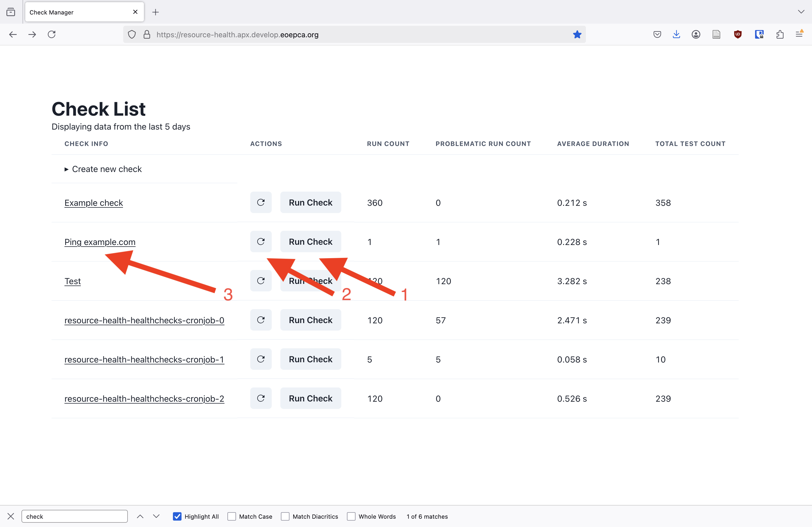

# Tutorials

Tutorials as a learning aid.

Note that all the links in the tutorial are for the development cluster, and you need to authenticate as one of the three standard users to create checks and view their results.
In other deployments the links will be different. I will also note all deployment dependant aspects as they come up. 

## Basic tutorial for users

In this tutorial we will learn:

* How to navigate the Health Check Web UI
* How to define a simple health check
* How to specify when the check runs (or run it on demand)
* How to view the health check generated telemetry and diagnose simple issues from it

You should follow along the following steps to get used to how things work.

1. Go to the Health Check website [https://resource-health.apx.develop.eoepca.org/](https://resource-health.apx.develop.eoepca.org/). As noted above, you should log in as one of the standard users.
2. Click on `Create new check`.
   
   From the dropdown shown below choose `simple ping template` check template (keep in mind that the platform might be configured to not have a check template exactly like this - the name of check template might be different, or it might not even exist, for example)
   
   Enter the values as you see below
   
   Note that `https://example.om/` deliberately contains a typo for us to see how to debug errors.  
   `schedule` is a CRON-style schedule specifying when the health check is to be executed. The schedule `0 0 1,15 * *` means the check will run `At 00:00 on day-of-month 1 and 15`. See [Cron Schedule](#cron-schedule) for more detailed information.
   Then click sumbit. Note that you might get an `AxiosError`, and that just means that it's been too long since you logged in. Just reload the page, log in, and fill in the details again.
3. After submitting the check, click on `Create new check` again (to hide the check creation form).  
   Your new check `Ping example.com` (or however you named it) should appear somewhere in the list, usually near the top.  
   Since the new check hasn't executed yet, all the stats in the table show empty values for it.  
   Click `Run Check`. The check should now run in the background, and you can click reload (**&#10227;**) button next to it to refresh the telemetry for this check. Once run information appears (the run should have failed, as indicated by `problematic run count` being non-zero), click on the check to get more details on the check runs.
   
4. A page for a single check should open. Scroll to the bottom of the page. It should look something like below.
   
   In particular, you can see the error message, the end of which is
   ```
   Failed to resolve 'example.om' ([Errno -2] Name or service not known)"))
   ```
   We see that it couldn't ping `example.om` as no such domain exists.
5. We conclude that we defined the check incorrectly. We will remove it, and create a new one without the typo. Click on `Remove Check`. Confirm check removal when the popup appears.
   
6. Now go create the check using step 2. but without the typo, of course. Then go do step 3. and 4., the check should now run successfully.
   Below is how the website home page should look when the check run succeeds, and after that how the individual check page should look.
   
   

<!-- TODO: add an OpenSearch dashboards visualization here? -->

## Advanced tutorial for users

In this tutorial it is assumed that you are familiar with the basics, such as having followed [Basic tutorial for users](#basic-tutorial-for-users)

In this tutorial we will learn:

* How to define more complex health checks
* How to inspect detailed check telemetry
* How to use detailed check telemetry

Follow along the following steps:

1. Go to the Health Check website [https://resource-health.apx.develop.eoepca.org/](https://resource-health.apx.develop.eoepca.org/). Again, you should log in as one of the standard users.
2. We will create a health check which will execute the Python script below using the [Pytest](https://docs.pytest.org/en/stable/) testing framework.
   ```python
   import random
   import pytest

   ## Utility functions that will be moved into library

   from opentelemetry import trace
   from opentelemetry.util import types
   def report_custom(attributes: dict[str, types.AttributeValue]) -> None:
       cur_span = trace.get_current_span()
       cur_span.set_attributes(attributes)

   # USER DEFINED CODE START

   def test_that_generates_custom_telemetry1() -> None:
       ## Something returned by a service, or similar
       outcome = random.random()
       report_custom({"resourcehealth.example.random_outcome": outcome})
       assert outcome <= 1

   def test_that_generates_custom_telemetry2() -> None:
       ## Something returned by a service, or similar
       outcome1 = random.random()
       outcome2 = random.random()

       ## To simplify filtering when you have multiple
       ## values, include a "has_xyz"
       report_custom(
           {
               "resourcehealth.example.has_outcome": True,
               "resourcehealth.example.random_outcome1": outcome1,
               "resourcehealth.example.random_outcome2": outcome2,
           }
       )
       assert abs(outcome1 - outcome2) <= 1
   ```
   See [Health Check Script](#health-check-script) for more details about health check scripts.  
   Create new check just like before. This time you should use `generic script template`. Set `Name`, `Description`, and `Schedule` to whatever you like (see [Cron Schedule](#cron-schedule) for a refresher on scheduling). Then input 
   ```
   https://gist.githubusercontent.com/tilowiklundSensmetry/aa8a28ab9bc432b8a76635a238c9aa11/raw/9dc5847959a909ffbaeb1a9239bbf10ad442266f/test_producing_custom_data.py
   ```
   in the `Script` field (this is a link to the script above). Alternatively, you could put the script encoded as a Data URL in there, see [Data URL](#data-url) for details.
   The check creation should look something like this
   
   Click `Submit`
3. Run the check once, just as before. The check should succeed. Now go to the check results table and click on the check ID (TODO: show screenshot). A page with the raw telemetry for that check run should open up - in here you see what information is stored about each check run in the database. See [Raw Health Check Telemetry](#raw-health-check-telemetry). In particular, you can search (with ctrl + F) for `resourcehealth.example.random_outcome` or `resourcehealth.example.random_outcome1` and see those results.
4. We will now see one way to use the detailed health check telemetry. We will create a health check which looks into the telemetry generated from the above checks and verifies that the results from above overall are as expected. The check code is shown below
   ```python
   from datetime import timedelta
   from statistics import median
   import pytest

   ## Utility functions that will be moved into library

   from typing import Any
   from opensearchpy import AsyncOpenSearch
   import asyncio

   from python_opentelemetry_access.proxy import Proxy
   from python_opentelemetry_access.proxy.opensearch.ss4o import OpenSearchSS40Proxy


   def get_opensearch_proxy() -> Proxy:
       opensearch_params: dict[str, Any] = {}
       opensearch_params.update({"verify_certs": False, "ssl_show_warn": False})
       client = AsyncOpenSearch(
           # hosts=[{"host": "opensearch-cluster-master-headless", "port": 9200}],
           hosts=[{"host": "127.0.0.1", "port": 8080}],
           use_ssl=False,
           **opensearch_params,
       )
       return OpenSearchSS40Proxy(client)


   @pytest.fixture
   def telemetry_proxy() -> Proxy:
       proxy = get_opensearch_proxy()
       yield proxy
       async def proxy_close():
           await proxy.aclose()
       asyncio.run(proxy_close())

   # USER DEFINED CODE START

   @pytest.mark.filterwarnings("ignore:enable_cleanup_closed.*:DeprecationWarning")
   def test_that_inspects_custom_telemetry1(telemetry_proxy: Proxy) -> None:
       previous_outcomes = [
           span.attributes["resourcehealth.example.random_outcome"]
           for span in telemetry_proxy.load_span_data_sync(
               span_attributes={
                   # None means "any value" for now, will change
                   "resourcehealth.example.random_outcome": None
               },
               max_data_age=timedelta(weeks=4),
           )
       ]

       print(f"random_outcomes: {previous_outcomes[:10]}{'' if len(previous_outcomes) < 10 else '...'}")

       assert len(previous_outcomes) > 0
       assert median(previous_outcomes) < 0.8

   @pytest.mark.filterwarnings("ignore:enable_cleanup_closed.*:DeprecationWarning")
   def test_that_inspects_custom_telemetry2(telemetry_proxy: Proxy) -> None:
       previous_outcome_diffs = [
           span.attributes["resourcehealth.example.random_outcome1"]
           - span.attributes["resourcehealth.example.random_outcome2"]
           for span in telemetry_proxy.load_span_data_sync(
               span_attributes={
                   "resourcehealth.example.has_outcome": [True],
               },
               max_data_age=timedelta(weeks=4),
           )
       ]

       print(f"random_diffs: {previous_outcome_diffs[:10]}{'' if len(previous_outcome_diffs) < 10 else '...'}")

       assert median(previous_outcome_diffs) - min(previous_outcome_diffs) < 1.8
       assert max(previous_outcome_diffs) - median(previous_outcome_diffs) < 1.8
   ```
   Create a new check just like before, and put
   ```
   https://gist.githubusercontent.com/tilowiklundSensmetry/47d5a9bb2a9aa66ca4cfc71ba70814ff/raw/43f04c63aae58838b0de5211b35ca339328b3678/test_consuming_custom_data.py
   ```
   in the `Script` field.  
   Click `Submit`
5. So that this check has more data to inspect, run the previous check a few times manually (you don't need to wait for one run to finish to run the check again). Then run the current check once. As the `random_outcome`, `random_outcome1`, `random_outcome2` are random, the aggregate check might or might not succeed, but the more times the original check runs, the more likely the aggregate check to succeed. That's it!

## Tutorial for platform administrators

The two most important configuration parts are defining hooks and check templates.

### Health Check Templates

In this tutorial we will learn:

* How to configure what kinds of health checks the users can create

Health check templates define what kinds of checks users can create, what parameters users need to supply to create the checks, and how those parameters are interpreted.

You can see example check templates [here](https://github.com/EOEPCA/resource-health/tree/58087ff26eca34e6aeaf58216fd87b18b745e36b/check_manager/example_k8s_templates).

The health checks generally are just [Pytest](https://docs.pytest.org/en/stable/) scripts which generate appropriately annotated OpenTelemetry traces upon execution. See [Health Check Script](#health-check-script) for more details about health check scripts.  
Health check template definition is just a Python script. To be picked up as a check template script it's easiest to just include the code of the script [here](https://github.com/EOEPCA/resource-health/blob/58087ff26eca34e6aeaf58216fd87b18b745e36b/helm/values.yaml#L39).
<!-- (TODO: add a note what to do if want script in a file, and not inline here?) -->
The Python script creates a class which specifies what check arguments exist, how to interpret them, and any additional setup necessary to execute the checks. At least for now, the health check template will get the user supplied check arguments, and will need to specify what Python script to execute, what additional dependencies the script needs, and what environment variables to set.  
For example, below is a simple script template.
```python
from check_backends.k8s_backend.template_utils import *

class ScriptTemplateArguments(BaseModel):
    script: str = Field(json_schema_extra={"format": "textarea"})
    requirements: str = Field(json_schema_extra={"format": "textarea"}, default="")


GenericScriptTemplate = simple_runner_template(
    template_id="generic_script_template",
    argument_type=ScriptTemplateArguments,
    label="Generic script template",
    description="Runs a user-provided pytest script from a specified remote or data url",
    script_url=lambda template_args, userinfo: template_args.script,
    requirements_url=lambda template_args, userinfo: template_args.requirements,
    user_id=lambda template_args, userinfo: userinfo["username"],
    otlp_tls_secret="resource-health-healthchecks-certificate",
)
```
It expects URLs to the script and requirements.txt files. [Data URLs](#data-url) can also be used. The dependencies listed [here](https://github.com/EOEPCA/resource-health/blob/58087ff26eca34e6aeaf58216fd87b18b745e36b/pytest-health/runner-image/base_requirements.txt) are always included, and requirements.txt can be omitted if no additional dependencies are needed.
!!! note
    The base requirements link shows requirements as they were when the commit `58087ff26eca34e6aeaf58216fd87b18b745e36b` was made. The current base dependencies might be slightly different, look for this file in the current main branch.
And it specifies to execute the given script with the given requirements.txt file, and doesn't set any environment variables.
The `GenericScriptTemplate` variable stores a class which is what the K8s backend uses to create this check.  
!!! warning
    Do not forget to create a variable which stores the result of `simple_runner_template`, otherwise the health check template will effectively be discarded upon creation.

Let's look at another template example.
```python
from check_backends.k8s_backend.template_utils import *
from typing import TypedDict

SIMPLE_PING_SRC = """from os import environ
import requests

GENERIC_ENDPOINT: str = environ["GENERIC_ENDPOINT"]
EXPECTED_STATUS_CODE: int = int(environ["EXPECTED_STATUS_CODE"])


def test_ping() -> None:
    response = requests.get(
        GENERIC_ENDPOINT,
    )
    assert response.status_code == EXPECTED_STATUS_CODE
"""


class SimplePingArguments(BaseModel):
    endpoint: str = Field(json_schema_extra={"format": "textarea"})
    expected_status_code: int = Field(ge=100, lt=600, default=200)


SimplePing = simple_runner_template(
    template_id="simple_ping",
    argument_type=SimplePingArguments,
    label="Simple ping template",
    description="Simple template with preset script for pinging single endpoint.",
    script_url=src_to_data_url(SIMPLE_PING_SRC),
    runner_env=lambda template_args, userinfo: {
        "GENERIC_ENDPOINT": template_args.endpoint,
        "EXPECTED_STATUS_CODE": str(template_args.expected_status_code),
    },
    user_id=lambda template_args, userinfo: userinfo["username"],
    otlp_tls_secret="resource-health-healthchecks-certificate",
)
```
It has a health check script (`SIMPLE_PING_SRC`) already defined (as a Python string), and expects the user to just supply the ping endpoint and the expected status code, which will be stored in an environment variable, and used when the script is being executed.  
Note that as `simple_runner_template` function needs a URL to the check script, `SIMPLE_PING_SRC` script is encoded as [Data URL](#data-url) before being passed to the function.

It is expected that most health check templates will be like this - some predefined script, and put the user-supplied check arguments to environment variables to be used by the script upon execution.

### Hooks

In this tutorial we will learn:

* How to configure Health Check API and Telemetry API backends using hooks
* How to configure Health Check API and Telemetry API authentication using hooks

Hooks are Python functions which define API backend and authentication configuration. The following hook parts are common for both Health Check API and Telemetry API hooks:

1. `UserInfo` type definition. You will produce a value of this type upon inspecting the user authentication data, and you will use it later on to make authentication decisions such as "Bob gets to use this check template and Alice does not".  
    Note that Python is dynamically typed, so you don't have to do this, but it shows your tooling what you expect, and thus the tooling (such as mypy) can point to your mistakes before executing the code.
    <!-- TODO: add a note of how to set up stuff to get type checking of hooks code. -->
    For example
    ```python
    class UserInfo(TypedDict):
        userid: str
        username: str
        access_token: str
        refresh_token: str | None
    ```
2. The hooks themselves, which are just python functions with certain names and signatures. The following hooks need to be defined for both Health Check API and Telemetry API.
    1. `get_fastapi_security`. Returns a function (or a callable class, see explained [here](https://stackoverflow.com/a/111255)), which takes a request object and returns authentication data from it. In the example below, the authentication data has `auth`, `id`, `refresh` tokens or `None`. You must implement this hook if you want the other authorization hooks to be able to make authorization decisions.
    For example
    ```python
    def get_fastapi_security() -> OIDCProxyScheme:
        return OIDCProxyScheme(
            openIdConnectUrl=os.environ["OPEN_ID_CONNECT_URL"],
            audience=os.environ["OPEN_ID_CONNECT_AUDIENCE"],
            id_token_header="x-id-token",
            refresh_token_header="x-refresh-token",
            auth_token_header="Authorization",
            auth_token_in_authorization=True,
            auto_error=True,  ## Set False to allow unauthenticated access!
            scheme_name="OIDC behind auth proxy",
        )
    ```
    2. `on_auth`. Takes the authentication data produced by calling the function (or callable class) returned from the `get_fastapi_security` hook. Decides if user is authorised to use the API (raises an exception if they aren't), creates `UserInfo` object which stores the relevant user authentication information, such as username, access token, etc. This function must also be implemented to make authorization decisions later on.
    For example
    ```python
    def on_auth(tokens: Tokens | None) -> UserInfo:
        if tokens is None or tokens["auth"] is None:
            raise APIException(
                Error(
                    status="403",
                    code="MissingTokens",
                    title="Missing authentication token",
                    detail="Potentially missing authenticating proxy",
                )
            )

        username_claim = (
            os.environ.get("RH_TELEMETRY_USERNAME_CLAIM") or "preferred_username"
        )

        return UserInfo(
            username=tokens["id"].decoded[username_claim]
            if tokens["id"] is not None and username_claim in tokens["id"].decoded
            else tokens["auth"].decoded["payload"].get(username_claim),
            access_token=tokens["auth"].raw,
        )
    ```

Keep in mind, that hooks are just Python functions, so you're free to do any other actions in them than what's described here. You could log user access instances, or emit notifications upon check creation and removal, for example. You could even modify the arguments provided to those functions.

#### Health Check API hooks

You should put Health Check API hooks code [here](https://github.com/EOEPCA/resource-health/blob/58087ff26eca34e6aeaf58216fd87b18b745e36b/helm/values.yaml#L82).
<!-- (TODO: add a note what to do if want script in a file, and not inline here?). -->

You can see example Health Check API hooks [here](https://github.com/EOEPCA/resource-health/tree/58087ff26eca34e6aeaf58216fd87b18b745e36b/check_manager/example_hooks).

In particular, [OIDC auth hooks](https://github.com/EOEPCA/resource-health/blob/58087ff26eca34e6aeaf58216fd87b18b745e36b/check_manager/example_hooks/oidc_auth/auth_hooks.py) is an example Health Check API hooks implementation for authentication with OpenID Connect protocol, and implements examples for all available Health Check API hooks.

Hooks script parts specific to Health Check API:

1. Imports. `from check_hooks.hook_utils import *` (or equivalent) should be included every time - it contains K8s config and secret helper functions. In addition import authentication stuff from `eoepca_security`.
2. Backend-agnostic authorization hooks, such as `on_template_access`, `on_check_create`, `on_check_run`, etc. give you an opportunity to forbid certain API functionality for certain users. Such authorization decisions can also take the data to be accessed/created/modified/deleted into account. Each of these hooks is optional, and not implementing it wouldn't impact any other hooks. See example below
    ```python
    def on_template_access(userinfo: UserInfo, template: CheckTemplate) -> bool:
        print("ON TEMPLATE_ACCESS")

        ## Only bob can use/access unsafe templates
        if userinfo["username"] != "bob" and template.id != "simple_ping":
            return False

        ## Only bob, alice, and eric can access the templates
        if userinfo["username"] not in ["bob", "alice", "eric"]:
            return False

        return True
    ```

    !!! info
        The access/usage is denied *only* if the hook returns `False`. If the hook doesn't exist, or returns other falsey values like `None`, the access/usage is allowed.
        <!-- TODO: write about multiple hooks here, I think such is possible. -->

3. Kubernetes configuration and authorization hooks:
    1. `get_k8s_config`. Takes `UserInfo` and returns `K8sConfiguration`. `check_hooks.hook_utils` has a few helper functions to help with this. You must implement this function to use the K8s backend (TODO: explain what a backend is in a couple of sentences somehwere, and K8s backend more specifically)
    2. `get_k8s_namespace`. Takes `UserInfo` and returns the namespace name. Must be implemented to use the K8s backend.
    3. `on_k8s_cronjob_create`. Takes `UserInfo`, `K8sClient`, and `K8sCronJob` parameters, and returns if the specified user is allowed to create the cronjob.

        !!! info
            `on_k8s_cronjob_create` hook is also often used to ensure that when the cronjob does execute, it has the user credentials available to authenticate against the OpenTelemetry collector and the telemetry database (TODO: make sure this is correct).
        The example below stores an offline token in a K8s secret, see info above for why that's necessary
        ```python
        async def on_k8s_cronjob_create(
            userinfo: UserInfo, client: K8sClient, cronjob: K8sCronJob
        ) -> bool:
            print("on_k8s_cronjob_create")

            ## Ensure cronjob is tagged with correct owner

            if (
                "owner" in cronjob.metadata.annotations
                and cronjob.metadata.annotations["owner"] != userinfo["username"]
            ):
                return False

            cronjob.metadata.annotations["owner"] = userinfo["username"]

            ## Ensure the user has an offline token set
            ## Note: Would be more robust to check on every access but use a cache
            secret_name = f"resource-health-{userinfo['username']}-offline-secret"
            secret_namespace = get_k8s_namespace(userinfo)

            offline_secret = await lookup_k8s_secret(
                client=client,
                namespace=secret_namespace,
                name=secret_name
            )

            if offline_secret is None:
                if userinfo['refresh_token'] is None:
                    raise APIException(Error(
                        status="404",
                        code="MissingOfflineToken",
                        title="Missing offline token, please create at least one check using the website",
                    ))
                await create_k8s_secret(
                    client=client,
                    name=secret_name,
                    namespace=secret_namespace,
                    string_data={
                        "offline_token": userinfo['refresh_token']
                    }
                )
        ```

    4. The remaining K8s backend hooks give you a chance to forbid certain K8s operations for certain users. Such authorization decisions can also take the `K8sClient` and `K8sCronJob` into account when making such decisions.

!!! info
    You can also configure what each hook is called through environment variables. You get the default naming by setting environment variables like so (or not setting them at all)
    ```
    GET_FASTAPI_SECURITY_HOOK_NAME=get_fastapi_security
    RH_CHECK_ON_AUTH_HOOK_NAME=on_auth
    RH_CHECK_ON_TEMPLATE_ACCESS_HOOK_NAME=on_template_access
    RH_CHECK_ON_CHECK_ACCESS_HOOK_NAME=on_check_access
    RH_CHECK_ON_CHECK_CREATE_HOOK_NAME=on_check_create
    RH_CHECK_ON_CHECK_REMOVE_HOOK_NAME=on_check_remove
    RH_CHECK_ON_CHECK_RUN_HOOK_NAME=on_check_run
    ```
    <!-- Which environment variables correspond to which hook names can be seen [here](https://github.com/EOEPCA/resource-health/blob/58087ff26eca34e6aeaf58216fd87b18b745e36b/check_manager/src/check_api/__init__.py#L92). -->
    This is mostly useful if you define multiple versions of the same hook, and then choose among them by setting environment variables.


#### Telemetry API hooks

You should put Telemetry API hooks code [here](https://github.com/EOEPCA/resource-health/blob/58087ff26eca34e6aeaf58216fd87b18b745e36b/helm/values.yaml#L111).
<!-- (TODO: add a note what to do if want script in a file, and not inline here?). -->

You can see example Telemetry API hooks implementation [here](https://github.com/EOEPCA/python-opentelemetry-access/blob/2275ab863e4d17dcd123ca48be35219acf36f21a/example_hooks/oidc_auth/auth_hooks.py). It implements authentication with OpenID Connect protocol, configuration to take telemetry from OpenSearch database.

Hooks script parts specific to Telemetry API:

1. Imports. `from python_opentelemetry_access.telemetry_hooks.utils *` (or equivalent) should be included every time - it contains `OpenSearchConfig` type and API exception classes. Also import authentication stuff from `eoepca_security`.
2. `get_opensearch_config` is the only Telemetry-API-specific hook at the moment. It takes `UserInfo` and returns OpenSearch proxy configuration, including authorization headers to be used for the given user.

!!! info
    Just like for Healh Check API hooks, you can configure what each hook is called through environment variables. You get the default naming by setting environment variables like so (or not setting them at all)
    ```
    RH_TELEMETRY_GET_FASTAPI_SECURITY_HOOK_NAME=get_fastapi_security
    RH_TELEMETRY_ON_AUTH_HOOK_NAME=on_auth
    ```
    This is mostly useful if you define multiple versions of the same hook, and then choose among them by setting environment variables.

## Appendix

### Cron Schedule

`schedule` is a CRON-style schedule specifying when the health check is to be executed. The schedule `0 0 1,15 * *` means the check will run `At 00:00 on day-of-month 1 and 15`. You can go to [https://www.baeldung.com/cron-expressions](https://www.baeldung.com/cron-expressions#cron-expression) to learn about Cron expression syntax, and to [https://crontab.guru](https://crontab.guru/#0_0_1,15_*_*) to see an explanation for your own schedule expression.  
!!! warning
    Not all tools which support CRON schedule expressions support exactly the same syntax. Some tools support more than the 5 standard parts of the expression, for example.

### Health Check Script

By default, health checks are just Python tests using [Pytest framework](https://docs.pytest.org/en/stable/), with some helper functionality provided by Resource Health BB. In principle, any program in any language could be considered a health check as long as it generates appropriately annotated [Opentelemetry](TODO: add link) traces upon execution, but Resource Health BB currently only provides means to execute Pytest-based checks.

!!! warning
    Test function names must start with `test`, and test class names must start with `Test`.

#### Getting Started

To get a simplest check going all you need to do is have a Python function starting with `test`, and use `assert` to check that results are as you expect, for example
```python
import requests

def test_simple_ping() -> None:
    response = requests.get("https://example.com/")
    assert response.status_code == 200
```

#### Check features

In the check file you can import any Python packages (though you need to specify them in requirements.txt field when you create the check in the website, for example) and use any Python 3.12 language features (such as loops, functions, match statements, etc.), and any Pytest features (such as fixtures, parametrization, etc.) in your test or outside of it. There are many great guides for writing Pytest tests, and you can also take a look at [Pytest official documentation](https://docs.pytest.org/en/stable/index.html) to learn more. For the rest of this chapter we will focus on the functionality most relevant to health checks.

The below code (also used above to create a check) demonstrates how to add some custom data to the current span. This could be used to log things like computation results to be checked for consistency among different runs later, for example.  
Just as the comments note, the top part of this will later be moved into a library.
```python
import random
import pytest

## Utility functions that will be moved into library

from opentelemetry import trace
from opentelemetry.util import types


def report_custom(attributes: dict[str, types.AttributeValue]) -> None:
    cur_span = trace.get_current_span()
    cur_span.set_attributes(attributes)


# USER DEFINED CODE START


def test_that_generates_custom_telemetry1() -> None:
    ## Something returned by a service, or similar
    outcome = random.random()

    report_custom({"resourcehealth.example.random_outcome": outcome})

    assert outcome <= 1


def test_that_generates_custom_telemetry2() -> None:
    ## Something returned by a service, or similar
    outcome1 = random.random()
    outcome2 = random.random()

    ## To simplify filtering when you have multiple
    ## values, include a "has_xyz"
    report_custom(
        {
            "resourcehealth.example.has_outcome": True,
            "resourcehealth.example.random_outcome1": outcome1,
            "resourcehealth.example.random_outcome2": outcome2,
        }
    )

    assert abs(outcome1 - outcome2) <= 1
```

The code below demonstrates checking the telemetry added by the test above.
```python
from datetime import timedelta
from statistics import median
import pytest

## Utility functions that will be moved into library

from typing import Any
from opensearchpy import AsyncOpenSearch
import asyncio

from python_opentelemetry_access.proxy import Proxy
from python_opentelemetry_access.proxy.opensearch.ss4o import OpenSearchSS40Proxy


def get_opensearch_proxy() -> Proxy:
    opensearch_params: dict[str, Any] = {}

    opensearch_params.update({"verify_certs": False, "ssl_show_warn": False})

    client = AsyncOpenSearch(
        # hosts=[{"host": "opensearch-cluster-master-headless", "port": 9200}],
        hosts=[{"host": "127.0.0.1", "port": 8080}],
        use_ssl=False,
        **opensearch_params,
    )
    return OpenSearchSS40Proxy(client)


@pytest.fixture
def telemetry_proxy() -> Proxy:
    proxy = get_opensearch_proxy()
    yield proxy

    async def proxy_close():
        await proxy.aclose()

    asyncio.run(proxy_close())


# USER DEFINED CODE START

@pytest.mark.filterwarnings("ignore:enable_cleanup_closed.*:DeprecationWarning")
def test_that_inspects_custom_telemetry1(telemetry_proxy: Proxy) -> None:
    previous_outcomes = [
        span.attributes["resourcehealth.example.random_outcome"]
        for span in telemetry_proxy.load_span_data_sync(
            span_attributes={
                # None means "any value" for now, will change
                "resourcehealth.example.random_outcome": None
            },
            max_data_age=timedelta(weeks=4),
        )
    ]

    print(f"random_outcomes: {previous_outcomes[:10]}{'' if len(previous_outcomes) < 10 else '...'}")

    assert len(previous_outcomes) > 0
    assert median(previous_outcomes) < 0.8

@pytest.mark.filterwarnings("ignore:enable_cleanup_closed.*:DeprecationWarning")
def test_that_inspects_custom_telemetry2(telemetry_proxy: Proxy) -> None:
    previous_outcome_diffs = [
        span.attributes["resourcehealth.example.random_outcome1"]
        - span.attributes["resourcehealth.example.random_outcome1"]
        for span in telemetry_proxy.load_span_data_sync(
            span_attributes={
                "resourcehealth.example.has_outcome": [True],
            },
            max_data_age=timedelta(weeks=4),
        )
    ]

    print(f"random_diffs: {previous_outcome_diffs[:10]}{'' if len(previous_outcome_diffs) < 10 else '...'}")

    assert median(previous_outcome_diffs) - min(previous_outcome_diffs) < 1.8
    assert max(previous_outcome_diffs) - median(previous_outcome_diffs) < 1.8
```

<!-- The data URL section is an exact copy (at the moment anyway) of https://github.com/EOEPCA/resource-health/tree/58087ff26eca34e6aeaf58216fd87b18b745e36b/pytest-health/runner-image#data-url.
Please keep them in sync. -->

#### Data URL

Data URLs allow encoding files as URLs. So instead of putting a file somewhere and providing a link to it for the health check definition, you can encode your file in a data URL instead. Data URL is a string `data:text/plain;base64,<data>` where `data` is base64 encoded string. One quick way to see the base64 data encoding and decoding is to use online tools such as [https://www.base64encode.org/](https://www.base64encode.org/) and [https://www.base64decode.org/](https://www.base64decode.org/) respectively.

Note that the data URLs are also supported in browsers, so you can inspect a data URL like `data:text/plain;base64,SGVsbG8gd29ybGQh` by opening it in a browser as if it was any other URL. The above data URL encodes `Hello world!` by the way.

See [Data URL](https://developer.mozilla.org/en-US/docs/Web/URI/Reference/Schemes/data) for more.


#### Raw Health Check Telemetry

Raw check telemetry is just appropriately annotated OpenTelemetry traces in [OTLP/JSON](https://opentelemetry.io/docs/specs/otlp/#json-protobuf-encoding) format. TODO: write what appropriately annotated means, i.e. what exact annotations are expected?

You can read more about distributed tracing in OpenTelemetry [here](https://opentelemetry.io/docs/concepts/observability-primer/#understanding-distributed-tracing) (For now we don't have log support, so you should skip that part).
